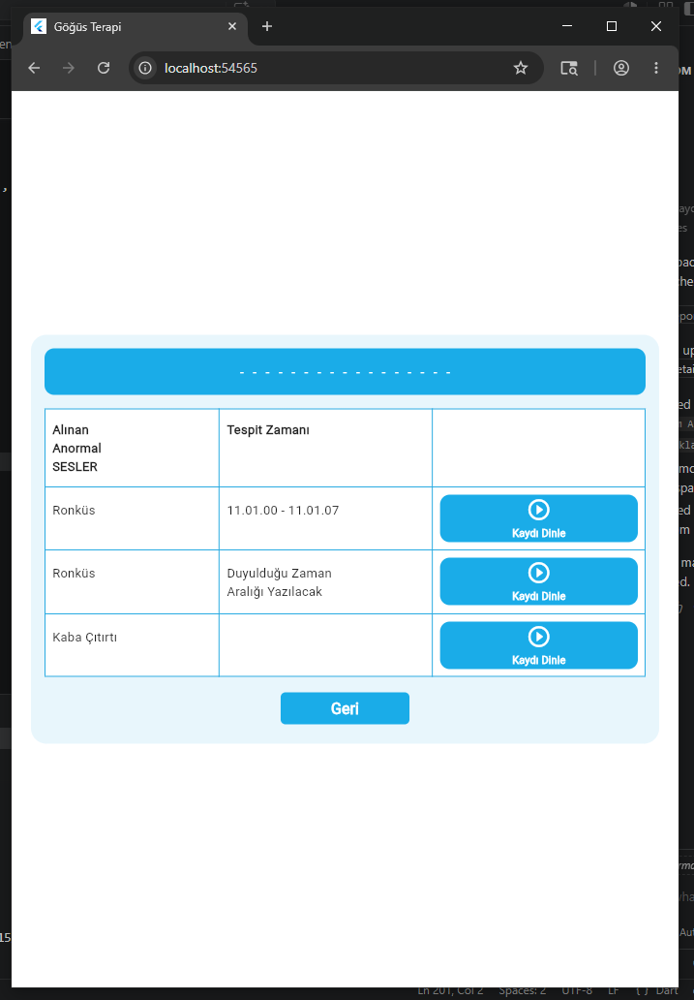
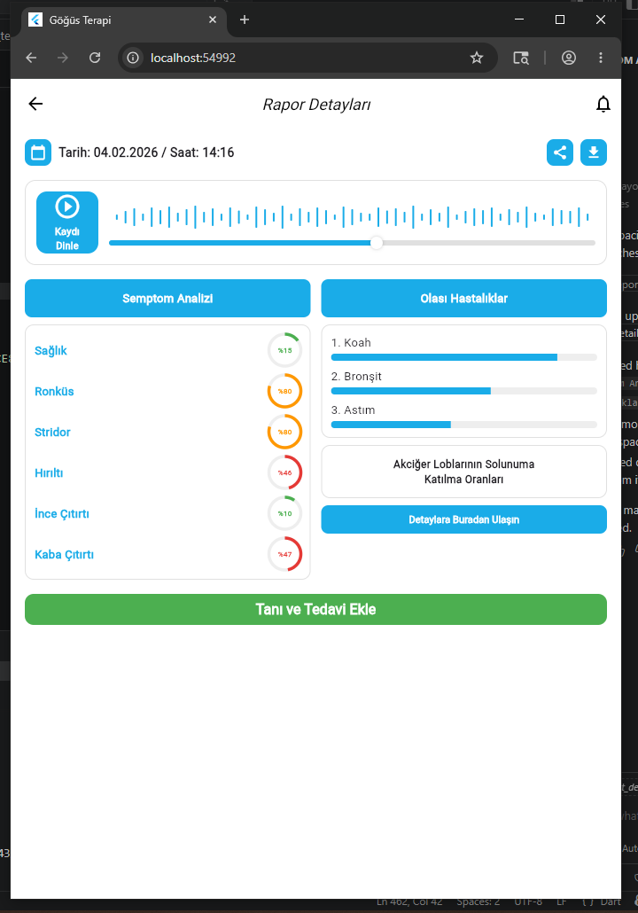
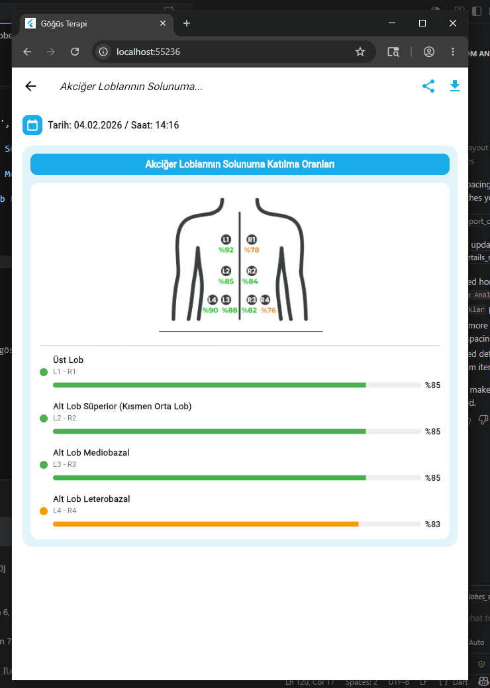
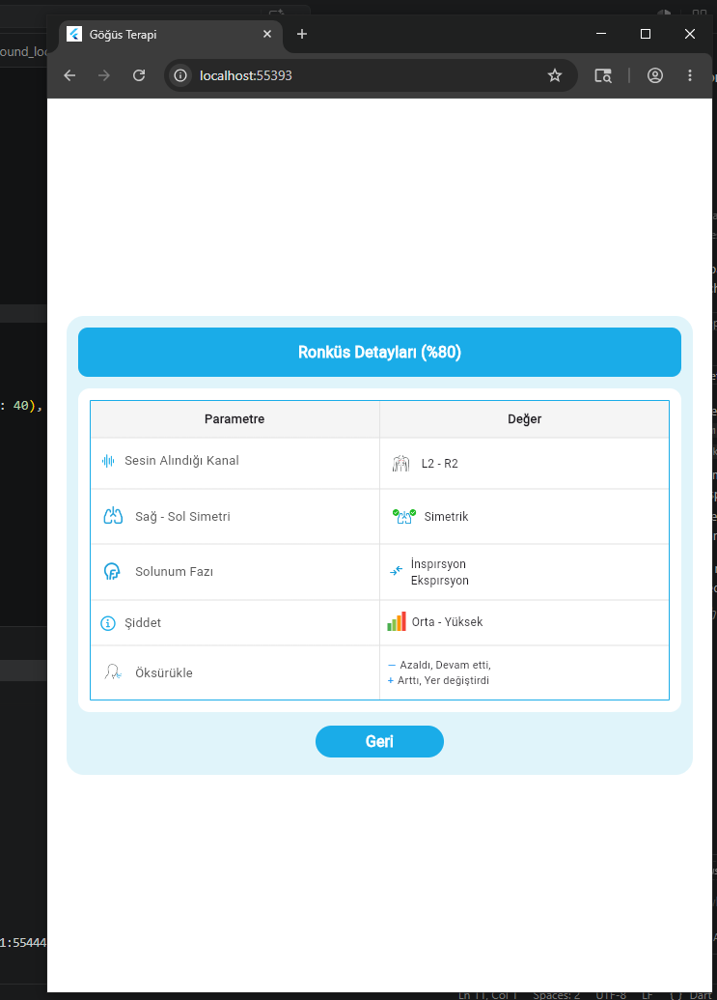
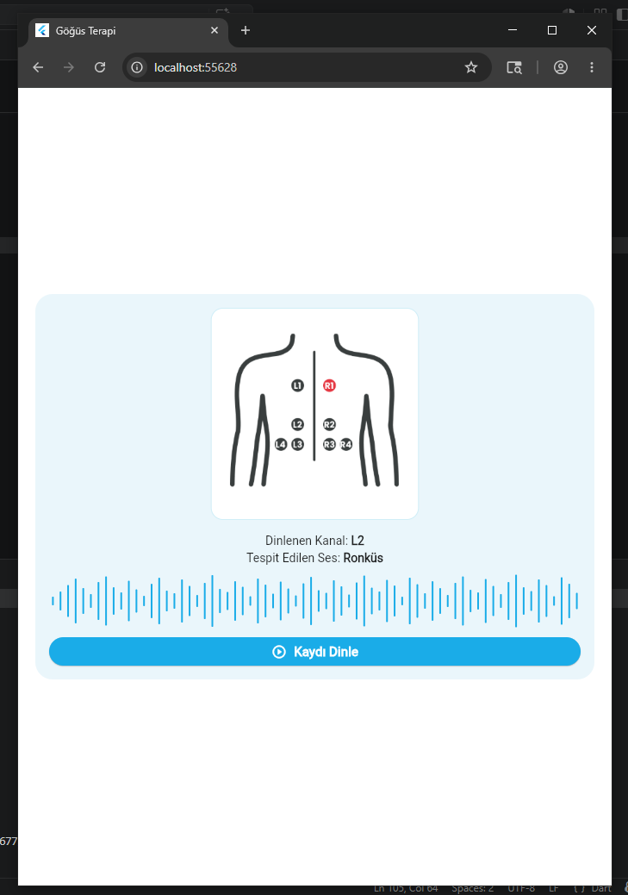
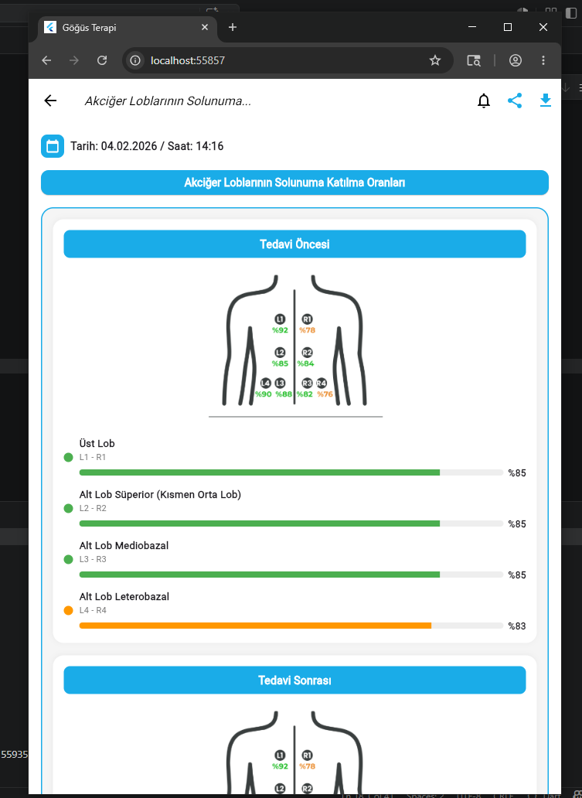

# 🫁 Göğüs Terapi Simülasyon Uygulaması

Flutter ile geliştirilmiş, akciğer sağlığını izlemeye ve göğüs fizyoterapisini desteklemeye yönelik mobil uygulama. Bluetooth sensör entegrasyonu ile gerçek zamanlı solunum sesi analizi yaparak anormal sesleri tespit eder, rapor üretir ve tedavi sürecini karşılaştırmalı olarak görselleştirir.

---

## 📱 Ekran Görüntüleri

| Rapor Detayları | Semptom Analizi | Akciğer Lobları |
|---|---|---|
|  |  |  |

| Semptom Detayı | Kanal Görünümü | Tedavi Karşılaştırması |
|---|---|---|
|  |  |  |

---

## ✨ Özellikler

- **Bluetooth Sensör Bağlantısı** — 8 kanallı akciğer sensörüne kablosuz bağlantı
- **5 Adımlı Solunum Testi Akışı** — adım adım yönlendirmeli test süreci
- **Anormal Ses Tespiti** — Ronküs, Stridor, Hırıltı, İnce/Kaba Çıtırtı sınıflandırması
- **Akciğer Lobu Haritalama** — L1-L4 / R1-R4 kanallarıyla lobların solunuma katılım oranları
- **Tedavi Öncesi/Sonrası Karşılaştırma** — akciğer performansının görsel karşılaştırması
- **Ses Kaydı Dinleme** — tespit edilen anormal seslerin kaydı
- **Olası Hastalık Analizi** — KOAH, Bronşit, Astım gibi hastalık olasılıkları
- **Rapor Paylaşma & İndirme** — oluşturulan raporun dışa aktarımı
- **Lottie Animasyonları** — bağlantı ve solunum adımları için animasyonlar
- **Text-to-Speech (TTS)** — sesli yönlendirme desteği

---

## 🛠️ Teknolojiler

- **Framework:** Flutter (Dart)
- **Bluetooth:** flutter_bluetooth_serial / flutter_blue_plus
- **Animasyon:** Lottie
- **Ses:** Text-to-Speech (TTS), ses dalga formu görselleştirmesi
- **Platform:** Android, iOS, Web

---

## 📁 Proje Yapısı

```
lib/
└── features/
    └── breathing_test/
        └── screens/
            ├── cihaz_baglantisi_ekrani.dart   # Bluetooth bağlantı ekranı
            ├── sensor_yerlesim_ekrani.dart    # Sensör yerleşim rehberi
            ├── dogru_pozisyon_ekrani.dart     # Pozisyon yönlendirme
            ├── hazirlik_ekrani.dart           # Test hazırlık ekranı
            ├── solunum_adim[1-5]_ekrani.dart  # 5 adımlı test akışı
            ├── hata_adim[1-5]_ekrani.dart     # Hata yönetimi ekranları
            └── test_tamamlandi_ekrani.dart    # Rapor & sonuç ekranı
assets/
├── animations/
│   ├── lungs.json                # Akciğer Lottie animasyonu
│   ├── WiFi Connecting.json      # Bağlantı animasyonu
│   └── sitting man.json          # Pozisyon animasyonu
└── images/
    └── sensor_yerlesim.png       # Sensör yerleşim görseli
```

---

## 🚀 Kurulum

```bash
# Bağımlılıkları yükle
flutter pub get

# Uygulamayı çalıştır
flutter run
```

> Flutter SDK 3.x ve Dart 3.x gerektirir.

---

## 👩‍💻 Geliştirici

**Ayşenur Aslan**  
Bilgisayar Mühendisliği — Selçuk Üniversitesi  
[github.com/asynrphix](https://github.com/asynrphix) · [LinkedIn](https://www.linkedin.com/in/aysenur-aslan-abba59411/)


